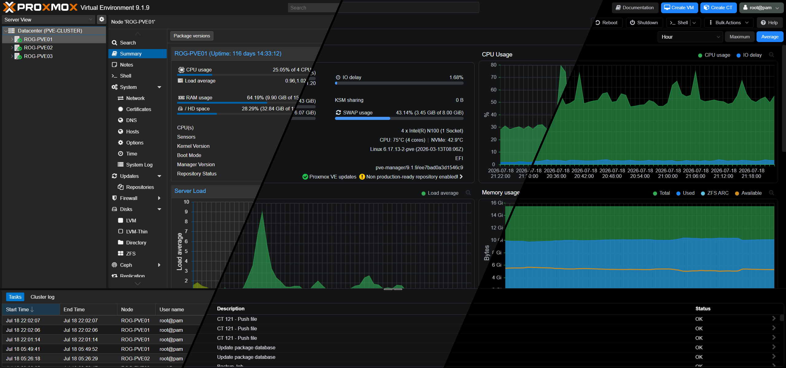

# ProxMorph

Custom themes for Proxmox VE (PVE), Proxmox Backup Server (PBS), and Proxmox Datacenter Manager (PDM) that integrate with the native Color Theme selector.

## ✨ Features

- **Native Integration** - Themes appear in built-in Color Theme dropdown (PVE, PBS, and PDM)
- **Auto-Patch on Updates** - Automatically re-applies themes after product updates
- **Hybrid Engine** - CSS for styling + JavaScript for dynamic chart patching
- **Hardware Sensor Monitoring** - Optional CPU/storage temps, fan speeds, and UPS status on node Summary dashboard (PVE)
- **Easy Installation** - Single command installation for PVE, PBS, and PDM

## 📸 Screenshot

Comparison between default Proxmox Dark theme and UniFi theme:



## 🎨 Themes

**22 themes** across 9 collections. Featured themes below — [**View Full Gallery →**](THEMES.md)

<table>
  <tr>
    <td width="50%" align="center">
      <h3>UniFi</h3>
      
      <br>
      <i>Inspired by Ubiquiti UniFi Network Application</i>
    </td>
    <td width="50%" align="center">
      <h3>Dracula</h3>
      
      <br>
      <i>Classic Dracula dark with purple accent</i>
    </td>
  </tr>
  <tr>
    <td width="50%" align="center">
      <h3>Catppuccin Mocha</h3>
      
      <br>
      <i>Darkest Catppuccin flavor — deep warm tones</i>
    </td>
    <td width="50%" align="center">
      <h3>Nord Dark</h3>
      
      <br>
      <i>Arctic dark palette with polar blue accent</i>
    </td>
  </tr>
</table>

<details>
<summary><strong>All Available Collections</strong></summary>

| Collection | Themes |
|------------|--------|
| Catppuccin | Mocha, Mocha Teal, Macchiato, Frappé, Latte |
| Dracula | Classic, Midnight, Pink, Cyan, Green, Orange |
| Nord | Dark, Light |
| Gruvbox | Dark, Light |
| Solarized | Dark, Light |
| Tokyo Night | — |
| UniFi | Dark, Light, OLED |
| GitHub Dark | — |
| Blue Slate | — |

</details>

## 🚀 Installation

### One-Liner Install

```bash
bash <(curl -fsSL https://raw.githubusercontent.com/IT-BAER/proxmorph/main/install.sh) install
```

### Manual Install

```bash
git clone https://github.com/IT-BAER/proxmorph.git
cd proxmorph
chmod +x install.sh
./install.sh install
```

### Apply Theme

1. Hard refresh browser (Ctrl+Shift+R)
2. Click username → Color Theme
3. Select a ProxMorph theme

## 💻 Commands

| Command | Description |
|---------|-------------|
| `./install.sh install` | Install themes |
| `./install.sh uninstall` | Remove themes |
| `./install.sh update` or `bash <(curl -fsSL https://raw.githubusercontent.com/IT-BAER/proxmorph/main/install.sh) update` | Updates (latest from GitHub) and install the latest themes |
| `./install.sh status` | Show installation status |
| `./install.sh default-theme <key\|none>` | Set a server-side default theme for new browsers (user choice always wins) |
| `./install.sh` | Shows Menu to manage|

## 🛠️ Creating Themes

1. Copy an existing theme from `themes/`
2. Rename to `theme-yourname.css`
3. Edit the first line: `/*!Your Theme Name*/`
4. Modify CSS styles
5. Run `./install.sh install`

Theme files must start with `/*!Display Name*/` - this sets the name in Proxmox's dropdown.

## ❓ Troubleshooting

### Themes not appearing in Color Theme dropdown

If themes don't appear after installation:

1. **Clear browser cache** — Press Ctrl+Shift+R (hard refresh)
2. **Run verify check** — Run `./install.sh` and select option 7 (Verify installation)
3. **Check installation status** — Run `./install.sh status`
4. **Restart proxy service** — Run `systemctl restart pveproxy` (PVE), `systemctl restart proxmox-backup-proxy` (PBS), or `systemctl restart proxmox-datacenter-api` (PDM)

### Cloudflare Tunnel caching issues

If you access Proxmox through a **Cloudflare Tunnel**, themes may not load due to aggressive caching. To fix:

1. Log in to [Cloudflare Dashboard](https://dash.cloudflare.com/) and select your domain
2. Navigate to **Caching → Cache Rules**
3. Click **Create rule**
4. Set **Hostname** to your Proxmox subdomain (e.g., `proxmox.example.com`)
5. Set **Cache eligibility** to **Bypass cache**
6. Save and deploy the rule

See [Issue #13](https://github.com/IT-BAER/proxmorph/issues/13) for more details — thanks to [@gioxx](https://github.com/gioxx) for the solution!

## ℹ️ How It Works

**PVE / PBS:**
1. Theme CSS files are copied to `/usr/share/javascript/proxmox-widget-toolkit/themes/`
2. JavaScript patches (for charts) are installed to product-specific JS directories
3. `proxmoxlib.js` is patched to register themes, and product index templates (`.tpl` or `.hbs`) are patched to load JS patches
4. An apt hook automatically re-patches after product updates
5. Themes appear in the native Color Theme selector

**PDM:**
1. PDM-specific CSS override themes are installed to `/usr/share/javascript/proxmox-datacenter-manager/proxmorph-themes/`
2. `<link>` tags are injected into `index.hbs` (disabled by default, activated by JavaScript)
3. A theme selector JS patch adds ProxMorph themes to PDM's native Theme dialog
4. Selected theme is persisted in `localStorage` and activated before WASM loads

## 📦 Supported Versions

- Proxmox VE 9.x / 8.x
- Proxmox Backup Server 4.x / 3.x
- Proxmox Datacenter Manager 1.x

## 📄 License

MIT License

<br>

## 💜 Support

If you like my themes, consider supporting this and future work, which heavily relies on coffee:

<div align="center">
<a href="https://www.buymeacoffee.com/itbaer" target="_blank"></a>
<br>
<a href="https://www.paypal.com/donate/?hosted_button_id=5XXRC7THMTRRS" target="_blank">Donate via PayPal</a>
</div>

<br>
